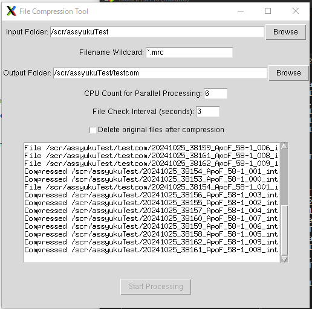

# MRC2TIF Compression Tool

A Python GUI tool (Tkinter) to compress `.mrc` files into `.tif` with LZW compression.  
Supports parallel processing, file monitoring, and optional deletion of originals.

## Features
- Watch input folder and auto-compress `.mrc` files
- Parallel processing with configurable CPU count
- GUI built with Tkinter
- English & Japanese manuals included

## Requirements
- Python 3.10+
- [IMOD (for mrc2tif)](https://bio3d.colorado.edu/imod/download.html#Latest-Windows)

## How to Use
- Run: `python mrc2tif_compression_tool.py`
- Configure input/output folders in the GUI
- Manuals: see `HotToUse_EN.txt` / `HotToUse_JP.txt`
- Screenshot: 
